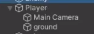

Make sure you add a character controller to your player as well as a collider and a rigidbody. Place an empty gameobject underneath your player with the layer "ground" and assign that in the inspector.

